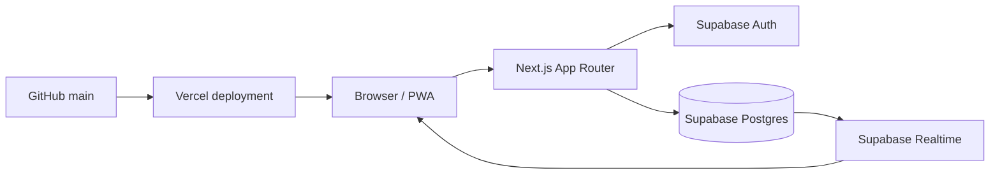
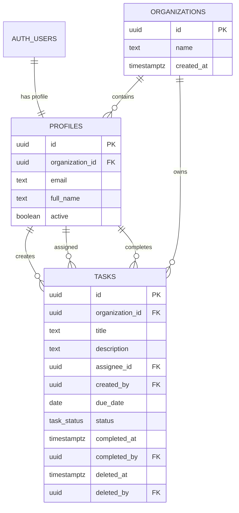
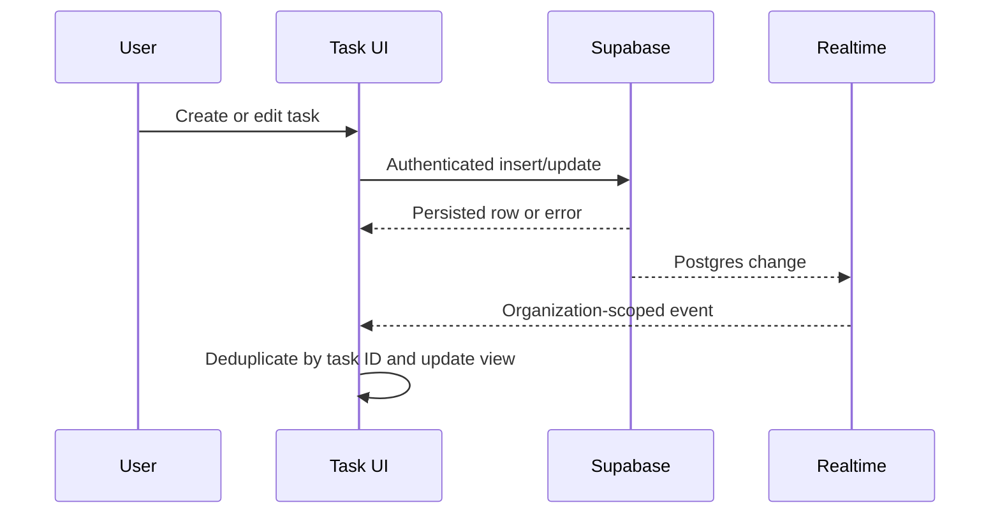

# Company Tasks Architecture

This is a living document. Update it when a change affects ownership, data flow, security, deployment, or the testing strategy.

## Product Boundary

Company Tasks is a shared, organization-scoped task list. The core lifecycle is:

```text
Create -> Assign -> Work -> Confirm completion -> Completed
                         \-> Soft delete (audit retained)
```

The product intentionally avoids projects, boards, dependencies, comments, and other project-management features.

## Current Runtime

- Next.js App Router
- TypeScript and React
- Supabase Auth, Postgres, Row Level Security, and Realtime
- Lucide icons
- CSS-based visual system in `app/globals.css`
- PWA manifest and service worker in `public/`
- Vitest for pure task behavior
- Playwright for browser smoke tests

The main task UI is currently implemented in `app/page.tsx`. It is functional, but the next architectural cleanup should extract the task list, details panel, forms, and workspace shell into focused components.

## System Context



The browser uses the Supabase publishable/anon key only. No service-role key belongs in the client or repository.

## Application Modes

### Production mode

When `NEXT_PUBLIC_SUPABASE_URL` and `NEXT_PUBLIC_SUPABASE_ANON_KEY` are configured, the app:

1. Loads the current Auth session.
2. Requires an active `profiles` row for that Auth user.
3. Loads the user's organization profiles and tasks.
4. Reads and writes tasks through Supabase.
5. Subscribes to organization-scoped task changes through Realtime.

The app remains on the sign-in entry state when there is no session.

### Demo mode

When Supabase configuration is absent, or when the test URL includes `?demo=1`, the app uses seeded in-memory demo data and local storage. This is used for local exploration and Playwright tests; it must not be treated as production persistence.

## Data Model

The schema lives in `supabase/migrations/0001_company_tasks.sql`.



Important rules:

- `due_date` is a Postgres `date`, not a timestamp, so calendar dates do not shift across time zones.
- Completion requires both `completed_at` and `completed_by`.
- Deletion is soft deletion through `deleted_at` and `deleted_by`.
- Normal task queries exclude deleted tasks.
- Organization membership is derived from the authenticated user's active profile.

## Security Model

RLS is enabled on organizations, profiles, and tasks.

The `current_organization_id()` security-definer function resolves the active user's organization. Policies then constrain reads and writes to that organization.

The client must not trust UI filtering for authorization. Supabase policies are the source of truth for organization boundaries.

Before expanding permissions, preserve these invariants:

- Users cannot read another organization's profiles or tasks.
- Users cannot create a task for another organization.
- Users cannot move a task into another organization through an update.
- Only authenticated users with active profiles can participate in the workspace.

## Task Data Flow



The UI waits for Supabase confirmation before applying edits, completion, or deletion. Realtime insert events are deduplicated because the creating client receives both the mutation response and its own realtime event.

## Code Ownership

- `app/page.tsx`: current workspace shell, task state, Supabase session bootstrap, task mutations, realtime subscription, and demo mode.
- `app/login/page.tsx`: email/password sign-in.
- `app/globals.css`: visual tokens, layout, responsive behavior, auth and People views.
- `lib/supabase.ts`: browser client creation and configuration detection.
- `lib/types.ts`: shared profile and database task shapes.
- `lib/task-utils.ts`: pure filtering, sorting, overdue, due-soon, and count logic.
- `supabase/migrations/`: database schema, indexes, RLS, and realtime publication.
- `tests/e2e/`: browser workflows against isolated demo mode.
- `lib/*.test.ts`: fast unit tests for pure task behavior.

## Testing Strategy

Run before release:

```bash
npm run lint
npm run typecheck
npm test
npm run test:e2e
npm run build
```

Current coverage includes task filtering, search, counts, optional due dates, completion confirmation, creation, and completed-task visibility.

Next test priorities:

1. Edit persistence and due-date removal in Playwright.
2. Soft deletion and reload persistence in Playwright.
3. Authenticated Supabase smoke tests using a dedicated non-production test user.
4. RLS tests for cross-organization access.
5. Responsive checks at mobile and desktop viewports.

## Deployment

GitHub `main` is the source of truth. Vercel builds the Next.js application.

Required Vercel environment variables:

```env
NEXT_PUBLIC_SUPABASE_URL=https://your-project.supabase.co
NEXT_PUBLIC_SUPABASE_ANON_KEY=your-anon-key
```

Supabase Authentication URL Configuration must include the deployed Vercel URL and the local development URL. The database migration must run before users are invited.

Never commit `.env.local`, Supabase service-role credentials, browser test artifacts, or `.vercel/` metadata.

## Evolution Plan

### Near term

- Extract `AppShell`, `TaskList`, `TaskRow`, `TaskDetails`, `TaskForm`, and `PeoplePanel` from `app/page.tsx`.
- Add a small task repository module so database operations are separate from UI state.
- Add consistent error/loading/saving states to every mutation.
- Add authenticated Playwright coverage and RLS verification.

### Later

- Add an organization setup/admin flow instead of manual SQL profile creation.
- Add profile editing and avatar support.
- Add an explicit workspace settings view.
- Add database timestamps/triggers for `updated_at`.
- Add observability and production error reporting.

Any later feature should preserve the simple shared-list workflow and organization-scoped authorization.

## Architecture Decisions

- Use Supabase directly from the browser for the first version because RLS provides the authorization boundary and Realtime is required.
- Keep due dates as calendar dates.
- Preserve completed and deleted rows for auditability.
- Prefer small explicit views and list rows over project-management abstractions.
- Keep demo mode because it makes local UI work and browser tests deterministic without touching production data.
